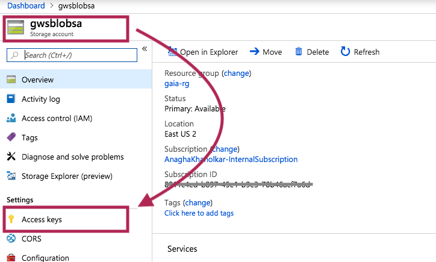
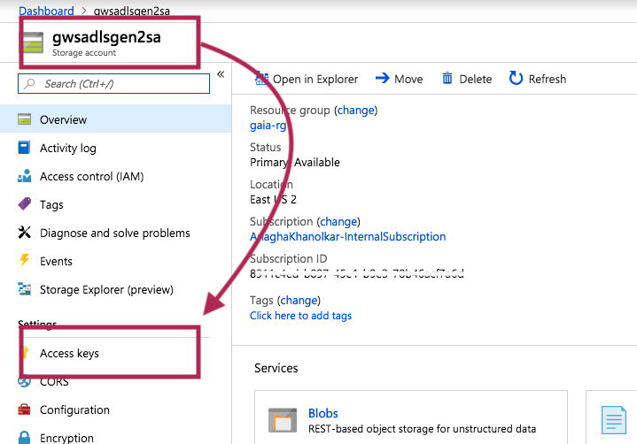

# Module 1
## Azure Storage - Lab instructions
In this module, we will work with Azure Blob Storage and Azure Data Lake Store Gen 2. 
The notebook path in your Databricks workspace is: general-workshop/01-primer/00-azure-storage 

### Unit 1: Secure storage credentils with Databricks secrets
We will learn to capture storage credentials and secure credentials with databricks secrets.
1.  Install Databricks CLI and confgure
2.  Create secret scope
3.  Add secrets to the scope defined

#### 1.  Capture storage credentials for Azure Blob Storage

 

 

 
 
#### 2.  Capture storage credentials for ADLS Gen 2

 

 

 

  

#### 3.  Databricks CLI setup
We will provision a Linux VM or use Azure Cloud Shell bash to install and configure Databricks CLI

#### 4.  Secrets setup
Refer notebook for instructions.

### Unit 2: Mount storage to the cluster
With mounting storage, you can permanently attach your Azure storage to the cluster with credentials secured one-time, and access the storage like you would - a regular file system, instead of storage URIs.

### Unit 3: File system operations
This is a foundational unit and covers working with directories and files on Databricks.

### Unit 4: Read/write primer
This is also a foundational unit and will cover what you will most commonly do as a data engineer.   
We will learn to  work with dataframes, create external tables and write spark SQL queries.  For this exerise, we will use the Chicago crimes public dataset - 1.5 GB, 6.7 million crimes. 

#### Load raw data: 
1.  Load some raw data to DBFS (in our case, we will download from the internet and then load to DBFS)
2.  Read the dataset in CSV format and persist to parquet format in the "raw" information zone in DBFS
3.  We will create an external table on the raw dataset and explore it with Spark SQL

#### Curate: 
1.  We will read the raw data, augment it (add derived attributes), transform it (data types and such)
2.  Persist to parquet format in the "curated" information zone in DBFS, partitioned by year and month 
3.  We will create an external table on the curated dataset and explore it with Spark SQL

#### Report and visualize: 
1.  We will write somequeries that we will run to generate some interesting visualizations
2.  We will learn basics of visualization on top of queries, within Databricks notebooks in this sub-unit.

### Unit 5: Databricks Delta primer
Also a foundational unit. For the rest of the workshop - we will use Databricks Delta that has a great value proposition for all analytics workloads.  In unit 5, we will learn the following basics of working with Delta by example-

1.  Create some data
2.  Persist to Delta format
3.  Create external table & query with Spark SQL
4.  Performance optimization with bin-packing
5.  Append operation
6.  Update/Upsert operation
7.  Delete operation
8.  Schema update
9.  Overwrite operation
10. Automatic schema update
11. Partitioning
12. Audit history

### Unit 6: ADLS Gen2 primer
In unit 3, we worked with Azure Blob Storage, in this unit, we will work with ADLS Gen2 as DBFS.
1.  We will create data
2.  Persist to delta format
3.  Create external table
4.  Run queries on it
 
