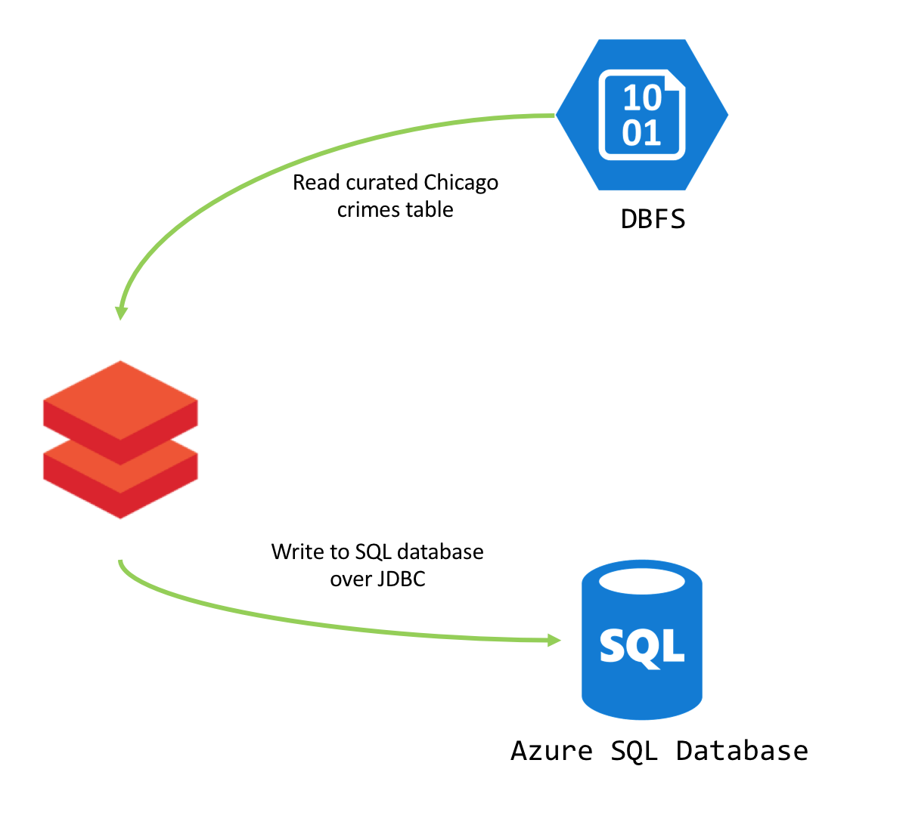

# 03. Azure SQL Database - Lab instructions

In this lab module - we will learn to integrate with Azure SQL databse from Spark - batch and with Spark Structured Streaming.  
- Batch lab:
In the batch lab - the source is the curated crimes dataset in DBFS, and the target is Azure SQL database 

 

- Streaming lab:
In the structured streaming lab, the source is the curated crimes dataset in DBFS, published to Azure Event Hub, and the sink is Azure SQL database. 

## A) Configuring the database server
### A1. Firewall settings 
Configure firewall settings as needed

### A2. Capture credentials

 

 

 

 

 

 

## B) Lab

### Unit 1. Secure credentials
Refer the notebook for instructions.

### Unit 2. Read/write in batch mode 
In this unit, we will read data in DBFS and write to Azure SQL database over JDBC. 
We will learn to write in parallel, and read in parallel, AND auto-create table and write, append and overwrite table.

### Unit 3. JDBC sink
Code from Databricks refactored for our dataset to sink to Azure SQL Database from Spark Structured Streaming.

### Unit 4. Publish to Azure Event Hub
We will re-run the event publisher from the event hub module.

### Unit 5. Consume from Azure Event Hub, sink to Azure SQL database
We will leverage structured streaming to read stream from Azure Event Hub, leverage the JDBC sink created, and write to Azure SQL database

