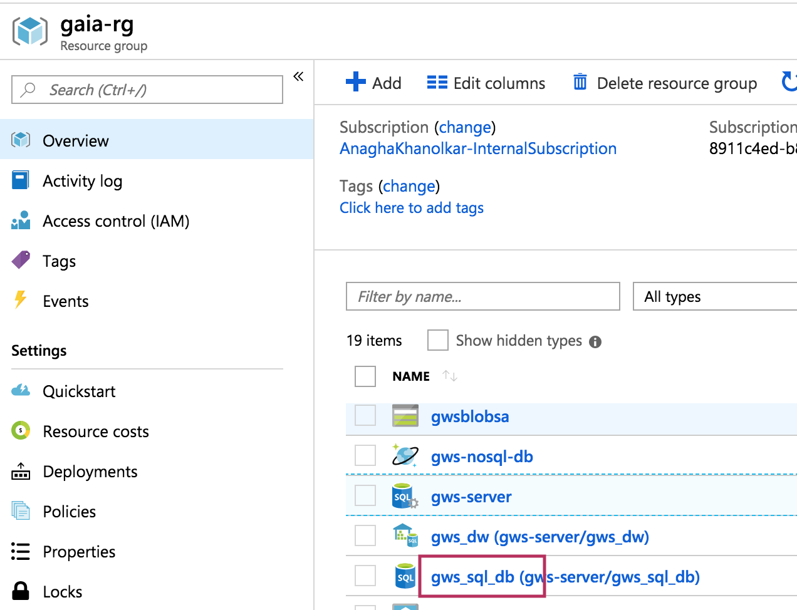

# 03. Azure SQL Database - Lab instructions

In this lab module - we will learn to integrate with Azure SQL databse from Spark - batch and with Spark Structured Streaming.  
- In the batch lab - the source is the curated crimes dataset in DBFS, and the target is Azure SQL database 
- In the structured streaming lab, the source is the curated crimes dataset in DBFS, published to Azure Event Hub, and the sink is Azure SQL database. 

## A) Configuring the database server
### A1. Firewall settings 
Configure firewall settings as needed

### A2. Capture credentials

 

 

 

 

 

 

## B) Lab units

### Unit 1. Secure credentials
Refer the notebook for instructions.

### 1.3. Readstream crime data from DBFS and publish events to Azure Event Hub with Spark Structured Streaming
We will read the curated Chicago crimes dataset in DBFS as a stream and pubish to Azure Event Hub using Structured Streaming.
Follow instructions in the notebook and execute step by step.

### 1.4. Consume events from Azure Event Hub
We will consume events from Azure Event Hub using Structured Streaming and sink to Databricks Delta.  Follow instructions in the notebook and execute step by step.

### 1.5. Query streaming events
We will create an external table on the streaming events and run queries on it.  Follow instructions in the notebook and execute step by step.

