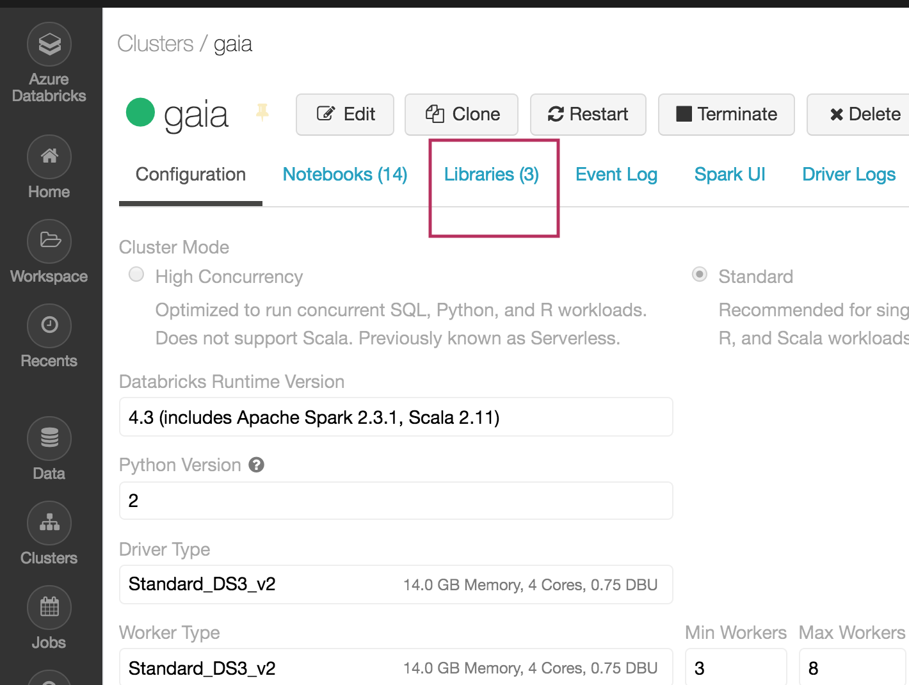
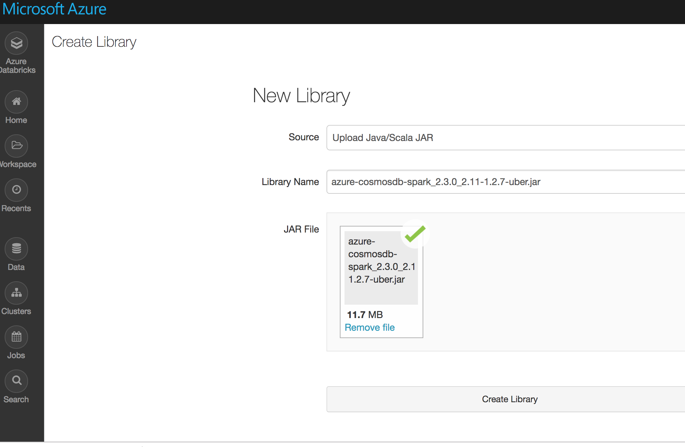
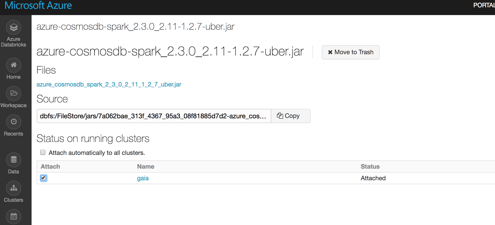
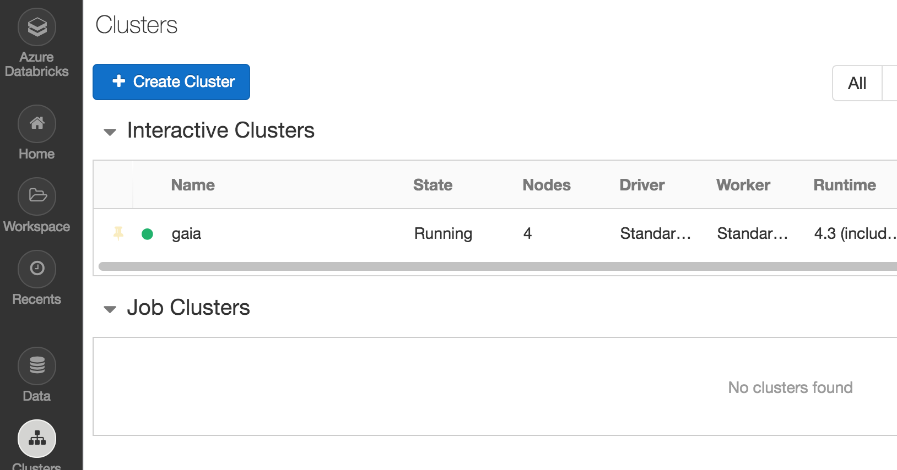

# 05. Azure Cosmos DB - Lab instructions

In this lab module - we will learn to integrate with Azure Cosmos DB from Spark - batch and with Spark Structured Streaming.  
- In the batch lab - the source is the curated crimes dataset in DBFS, and the target is Azure Cosmos DB. 
- In the structured streaming lab, the source is Azure Event Hub, and the sink is Azure Cosmos DB. 

## A) Provisioning and configuring

### A1. Capture URI and credentials

 

 

 

 

 

 

### A2. Create database and collection in the account

 

 

 

 

## B) Lab

### Unit 1. Secure credentials
Refer the notebook for instructions.

### Unit 2. Read/write in batch mode 
In this unit, we will read data in DBFS and write to Azure SQL Cosmos DB. 

### Unit 3. Publish to Azure Event Hub
We will re-run the event publisher from the event hub module.

### Unit 4. Consume from Azure Event Hub, sink to Azure Cosmos DB
We will leverage structured streaming to read stream from Azure Event Hub, and sink to Azure Cosmos DB.

