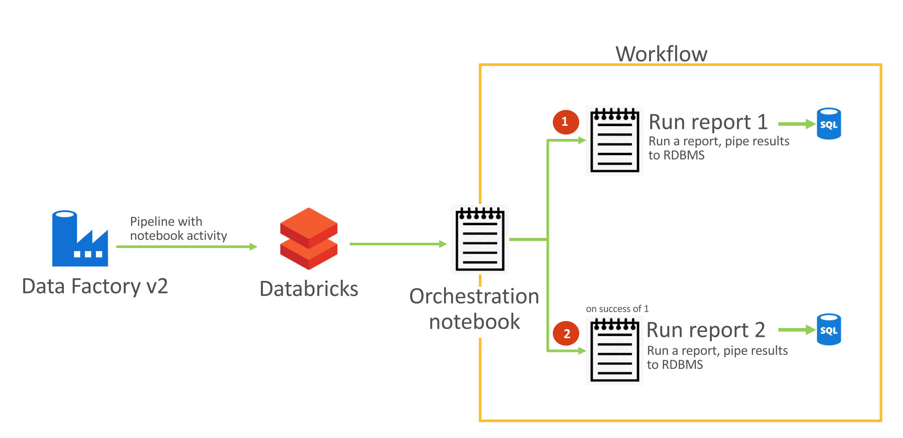

# 06. Azure Data Factory v2 - Lab instructions

In this lab module - we will learn to automate Databricks Spark applications with Azure Data Factory v2.  We will create a simple Data Factory v2 pipeline that runs a notebook activity. This Azure Data Factory v2 notebook activity, will spawn a new cluster in a pre-configured existing Databricks workspace, and invoke a pre-existing tested notebook workflow (calls two notebooks) defined in the Databricks workspace.We will learn to schedule the pipeline to run on a time basis, as well as run on-demand.  Finally, we will learn to monitor in Azure Data Factory v2.<br>

The following is a pictorial overview.<br>


## A) Dependencies
1.  Provision data factory
2.  Completion of primer lab for Azure Storage
3.  Completion of primer lab for Azure SQL Database
4.  Adequate cores to provision Azure databricks cluster
5.  Notebooks in the module, loaded into your workspace
6.  Database objects - tables created ahead of time

## B) Database objects to be created in Azure SQL Database

1.  Create table: batch_job_history
```
DROP TABLE IF EXISTS dbo.BATCH_JOB_HISTORY; 
CREATE TABLE BATCH_JOB_HISTORY( 
batch_id int, 
batch_step_id int, 
batch_step_description varchar(100), 
batch_step_status varchar(30), 
batch_step_time varchar(30) );
```

2.  Create table: chicago_crimes_count
```
DROP TABLE IF EXISTS dbo.CHICAGO_CRIMES_COUNT; 
CREATE TABLE CHICAGO_CRIMES_COUNT( 
case_type varchar(100), 
crime_count bigint);
```

3.  Create table: chicago_crimes_count_by_year
```
DROP TABLE IF EXISTS dbo.CHICAGO_CRIMES_COUNT_BY_YEAR; 
CREATE TABLE CHICAGO_CRIMES_COUNT_YEAR( 
case_year int,
case_type varchar(100), 
crime_count bigint);
```
## C) Notebook review

### 1.  Notebook workflow:
1.  Generates a batch ID
2.  Inserts into the ETL metadata table, BATCH_JOB_HISTORY, that the report 1 generation has started
3.  Runs report 1 notebook
4.  If report 1 completed successfully, inserts into the ETL metadata table, BATCH_JOB_HISTORY, that the report 1 generation has completed
5.  Inserts into the ETL metadata table, BATCH_JOB_HISTORY, that the report 2 generation has started
3.  Runs report 2 notebook
4.  If report 2 completed successfully, inserts into the ETL metadata table, BATCH_JOB_HISTORY, that the report 2 generation has completed

### 2. Report 1:
1.  Generates a report of count by crime type and pipes it to the pre-existing chicago_crimes_count RDBMS table in overwrite mode
2.  Exits with status of "pass" if completed successfully

### 3. Report 2:
1.  Generates a report of count by crime type, by year, and pipes it to the pre-existing chicago_crimes_count RDBMS table in overwrite mode
2.  Exits with status of "pass" if completed successfully
