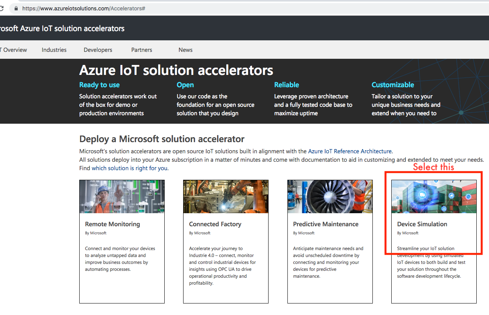
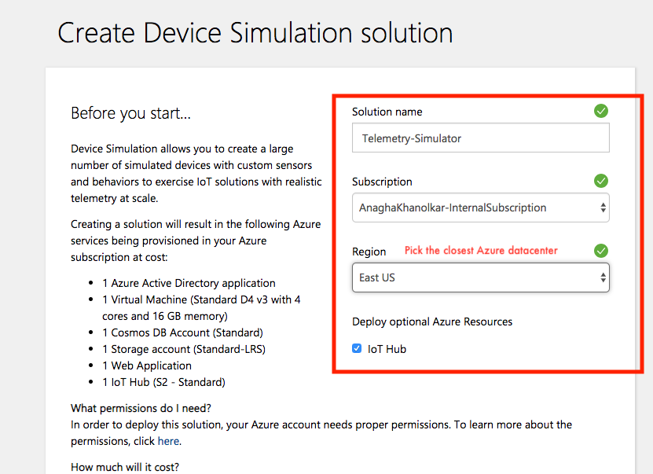
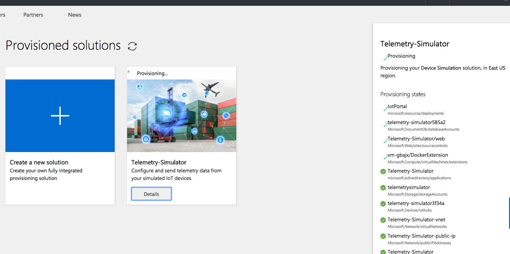
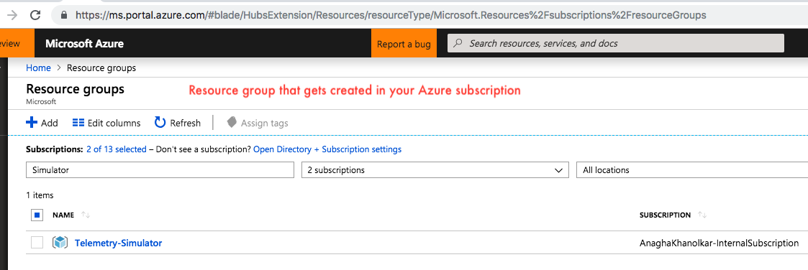
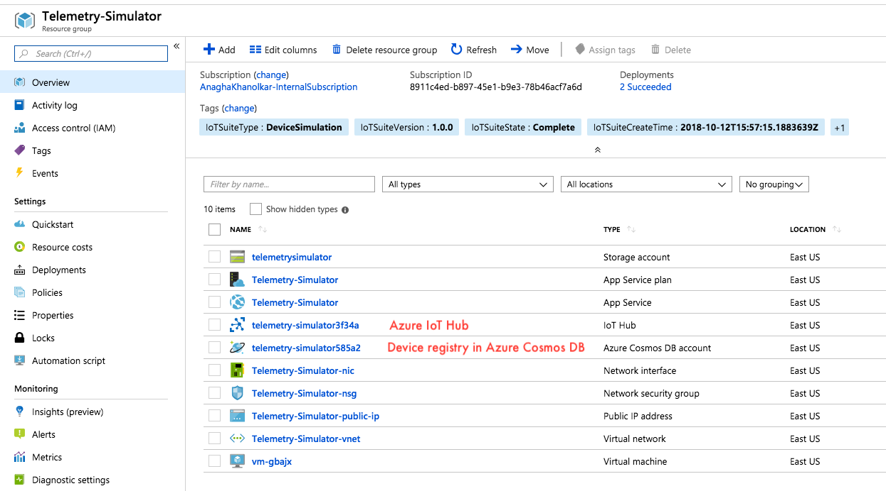

This section covers provisioning and all necessary configuration required for Azure IoT and the device telemetry simulator.

# 1. Azure IoT Hub
We will launch an Azure IoT solution accelerator for device simulation.  With a few clicks, this will provision an Azure IoT hub and provide a web page to select number of simulated devices, type of telemetry (e.g. chiller), and simulate telemetry at periodic intervals for a specific period of time or indefinitely.

### 1.0.1. Provision the device telemetry generator 
Go to https://www.azureiotsolutions.com/Accelerators and provision the "Device Simulation" accelerator.
Give it a meaningful name.  This will create an Azure IoT hub with Azure Cosmos DB as device registry a VM and such.










### 1.0.2. Create consumer groups
1.  From the Azure portal, navigate to the IoT hub instance provisioned in 3.0.1.<BR>
2.  Select Endpoints<BR>
3.  From "Built-in endpoints", select "Events"<BR>
4.  Create one consumer group called "kafkaConnect-cg"<BR>
5.  Create one consumer group called "spark-cg"<BR>

### 1.0.3. Capture key information needed for KafkaConnect and Spark integration
Capture the following:<br>
1. Event Hub-compatible name; e.g. ```bhoomi-telemetry-simulator```
2. Event Hub-compatible endpoint (starts with ```sb://```, ends with ```.servicebus.windows.net/```; e.g. ```sb://iothub-ns-bhoomi-tel-8....servicebus.windows.net/```
3. Partitions; E.g. ```4```
4. Shared access key<br>
On the portal, inside your IoT hub service, go to the left navigation panel and select "Shared Access Policies".  Then click on the policy "service", and capture the primary key

### 1.0.4. Launch the simulator
Launch the simulator from 3.0.1, against the provisioned Azure IoT instance, to run every 10 seconds with 200 devices, to run for an hour.
