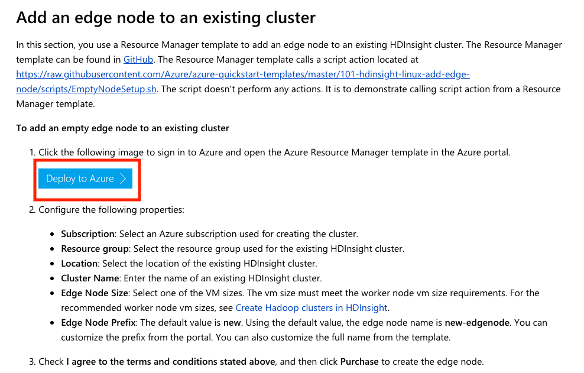
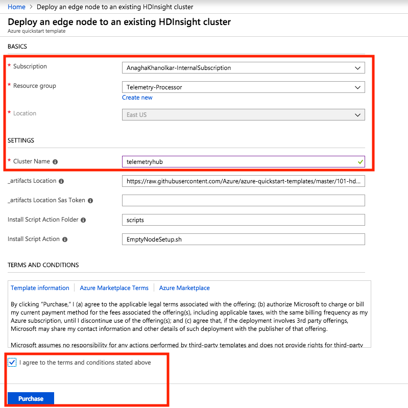
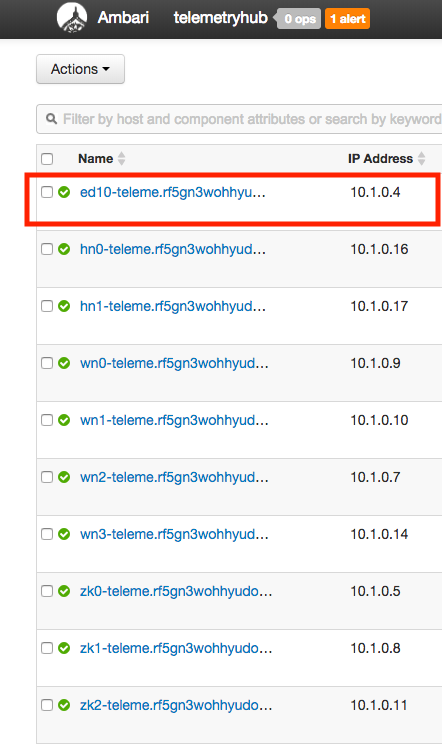

This section covers installing and configuring a standalone KafkaConnect instance.  This is typically not installed on the cluster, we will therefore provision an edge node for the purpose of KafkaConnect.

# 7. Install and configure KafkaConnect

## 7.0.1. Provision an edge node for the Kafka cluster

Follow the instructions at [this](https://docs.microsoft.com/en-us/azure/hdinsight/hdinsight-apps-use-edge-node#add-an-edge-node-to-an-existing-cluster) link to deploy an edge node that is automatically joined to the cluster.<BR>
  

<br><br><br>

<br><br><br>
Once the deployment completes, in the Ambari, hosts page, you should see the edge node listed.

<br><br><br>

## 7.0.2.  SSH to the edge node


## 7.0.3. Create a Kafka topic

#### 7.0.3.1. Create and populate cluster name into a variable
```
read -p "Enter the Kafka on HDInsight cluster name: " CLUSTERNAME
```

#### 7.0.3.2. Install jq to process json easily
```
sudo apt -y install jq
```
#### 7.0.3.3. Get broker list into a variable
```
export KAFKABROKERS=`curl -sS -u admin -G https://$CLUSTERNAME.azurehdinsight.net/api/v1/clusters/$CLUSTERNAME/services/KAFKA/components/KAFKA_BROKER | jq -r '["\(.host_components[].HostRoles.host_name):9092"] | join(",")' | cut -d',' -f1,2`
```
Validate:
```
echo $KAFKABROKERS
```
#### 7.0.3.4. Get zookeeper list into a variable
```
export KAFKAZKHOSTS=`curl -sS -u admin -G https://$CLUSTERNAME.azurehdinsight.net/api/v1/clusters/$CLUSTERNAME/services/ZOOKEEPER/components/ZOOKEEPER_SERVER | jq -r '["\(.host_components[].HostRoles.host_name):2181"] | join(",")' | cut -d',' -f1,2`
```
Validate:
```
echo $KAFKAZKHOSTS
```

#### 7.0.3.5. Create a topic
```
/usr/hdp/current/kafka-broker/bin/kafka-topics.sh --create --replication-factor 3 --partitions 8 --topic iot_telemetry_in --zookeeper $KAFKAZKHOSTS
```
You should see this..
```
iot_telemetry_in
```

#### 7.0.3.6. List the topic created<br>
```
/usr/hdp/current/kafka-broker/bin/kafka-topics.sh --list --zookeeper $KAFKAZKHOSTS
```
You should see this..
```
iot_telemetry_in
```

## 7.0.4. Download KafkaConnect for Azure IoT

7.0.4.1. Create a directory on the edge node to download the connector to:
```
mkdir -p opt/kafkaConnect
cd opt/kafkaConnect
```
7.0.4.2. Download the latest connector from here-<br>
https://github.com/Azure/toketi-kafka-connect-iothub/releases/.

At the time of authoring this lab..<br>
```
cd ~/opt/kafkaConnect
wget "https://github.com/Azure/toketi-kafka-connect-iothub/releases/download/v0.6/kafka-connect-iothub-assembly_2.11-0.6.jar"
sudo cp kafka-connect-iothub-assembly_2.11-0.6.jar /usr/hdp/current/kafka-broker/libs/
```

## 7.0.5. Configure a standalone source KafkaConnect instance for Azure IoT (source=Azure IoT Hub, sink=Kafka)


#### 7.0.5.1. Edit/add 4 pieces of configuration in the connect-standalone.properties file on the edge node<br>
```
sudo vi /usr/hdp/current/kafka-broker/config/connect-standalone.properties
```
1.  Replace ```localhost:9092``` in ```bootstrap.servers=``` conf to reflect broker-port list from [here](https://github.com/anagha-microsoft/databricks-workshops/blob/master/iot/docs/Provisioning-5-Kafka.md#605--capture-the-ip-addresses-of-the-brokers)<br>
E.g.  In the author's case - 10.1.0.7:9092,10.1.0.9:9092,10.1.0.10:9092,10.1.0.14:9092<br>

2.  Replace the ```key.converter=``` to read ``` key.converter=org.apache.kafka.connect.storage.StringConverter```
<br>
3.  Replace the ```value.converter=``` to read ```value.converter=org.apache.kafka.connect.storage.StringConverter```
<br>
4.  Add a line at the end of the file ```consumer.max.poll.records=200``` to prevent timeouts
<br>
<br>

### 7.0.5.2. Configure a connect-iot-source.properties

1. Download the connect-iot-source.properties<br>

```sudo wget -P /usr/hdp/current/kafka-broker/config/ https://raw.githubusercontent.com/Azure/toketi-kafka-connect-iothub/master/connect-iothub-source.properties```


2. Edit the connect-iot-source.properties to reflect the IoT hub source<br>
```
sudo vi /usr/hdp/current/kafka-broker/config/connect-iothub-source.properties
```
Modify the properties as follows:<br>
1.  ```Kafka.Topic=PLACEHOLDER```: Replace ```PLACEHOLDER``` with ```iot_telemetry```. Messages received from IoT hub are placed in the iot_telemetry-in topic.<br>
2.  ```IotHub.EventHubCompatibleName=PLACEHOLDER```: Replace ```PLACEHOLDER``` with the Event Hub-compatible name.<br>
3.  ```IotHub.EventHubCompatibleEndpoint=PLACEHOLDER```: Replace ```PLACEHOLDER``` with the Event Hub-compatible endpoint.<br>
4.  ```IotHub.Partitions=PLACEHOLDER```: Replace ```PLACEHOLDER``` with the number of partitions from the previous steps.<br>
5.  ```IotHub.AccessKeyName=PLACEHOLDER```: Replace ```PLACEHOLDER``` with service.<br>
6.  ```IotHub.AccessKeyValue=PLACEHOLDER```: Replace ```PLACEHOLDER``` with the primary key of the service policy.<br>
7.  ```IotHub.StartType=PLACEHOLDER```: Replace ```PLACEHOLDER``` with a UTC date. This date is when the connector starts checking for messages. The date format is yyyy-mm-ddThh:mm:ssZ.<br>
8.  ```BatchSize=100```: Leave as is. This change causes the connector to read messages into Kafka once there are five new messages in IoT hub.<br>
9. ```IotHub.ConsumerGroup=PLACEHOLDER```: Replace ```PLACEHOLDER``` with ```kafkaConnect-cg```. <br>
10.  Modify the ```connector.class=...``` entry to be ```connector.class=com.microsoft.azure.iot.kafka.connect.IotHubSourceConnector```
<br>
Save and close file.<br>

[Example of connect-iot-source.properties](https://github.com/Azure/toketi-kafka-connect-iothub/blob/master/README_Source.md)
[Full documenation](https://docs.microsoft.com/en-us/azure/hdinsight/kafka/apache-kafka-connector-iot-hub)
